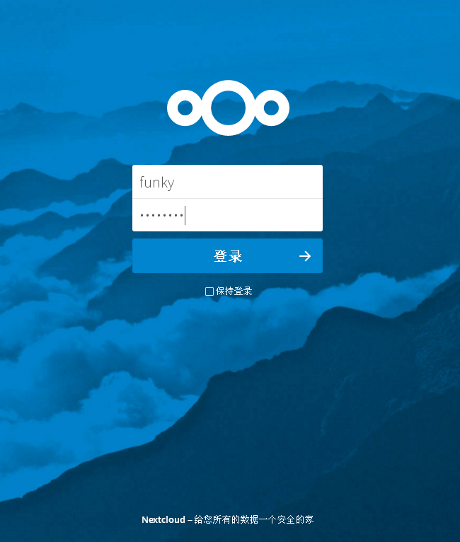
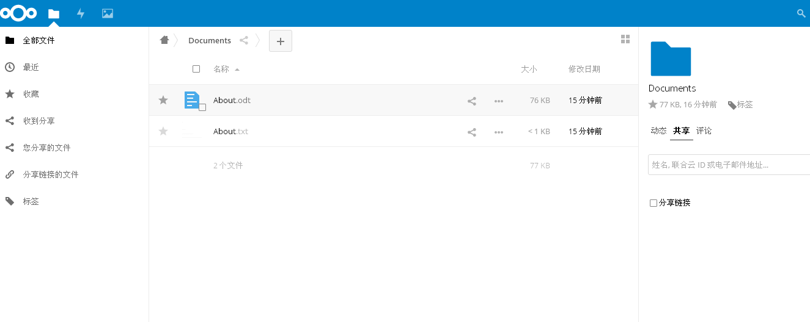

# Nextcloud-Docker
  NEXTCLOUD基于Docker集群部署方案

## 使用截图

### 登陆界面

### 导航

## 使用说明

  单机：
  
        docker-compose up -d
    
  集群：
  
        docker stack deploy -c docker-compose.yml
  
  部署完成后即可输入IP访问，并配置相关参数
  默认数据库用户名密码以及数据库名均为nextcloud 可自行在docker-compose.yml修改相关参数
  点击安装完成即可完成所有部署
  
